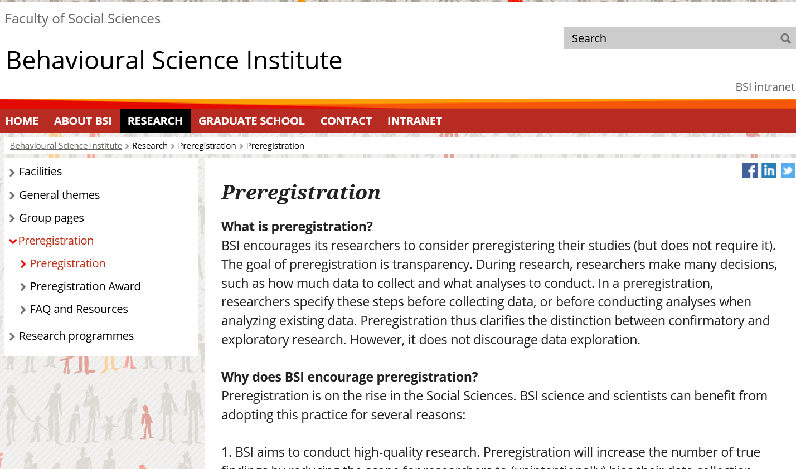

# Open Science {data-background-image="style/bsi_header.jpg" data-background-position="top left"}
## Julian Quandt {style="text-align: center"}
### Radboud University {style="text-align: center"}

 

# What is Open Science?

<iframe src="https://www.mentimeter.com/s/84ae0683d13f21e37b8a348ac93a2368/07098071d932" id="my-iframe" scrolling="no"></iframe>

# Preregistration

## What is Preregistration? 

 

<h3 class="element fragment" id="before-seeing-the-data" data-fragment-index="0">Before seeing the data</h3>

<ul>
<li class="fragment" data-fragment-index="1"><strong>What can I expect from the results?</strong>
<ul>
<li class="fragment" data-fragment-index="1">e.g.&nbsp;alternative hypotheses</li>
</ul></li>
<li class="fragment" data-fragment-index="2"><strong>What do I need to keep in mind   when conducting my experiment?</strong>
<ul>
<li class="fragment" data-fragment-index="2">e.g.&nbsp;sample size, exclusion criteria</li>
</ul></li>
<li class="fragment" data-fragment-index="3"><strong>How will I answer my question?</strong>
<ul>
<li class="fragment" data-fragment-index="3">e.g.&nbsp;confirmatory and exploratory</li>
</ul></li>
</ul>

# Resources on Preregistration?

[BSI View on Preregistration](https://www.ru.nl/bsi/research/preregistration/preregistration/)

[BSI Preregistration Award](https://www.ru.nl/bsi/research/preregistration/preregistration-award/)

[FAQ and Resources](https://www.ru.nl/bsi/research/preregistration/faq-resources/)

# BSI Scientific Rigor Group

A new initiative within the BSI:

- Connect people within the BSI who already have some expertise with Open Science
- Building a support infrastructure for Open Science Questions within the BSI and departments
- ... (this list is preliminary we just had our first meeting)

# Beyond Preregistration

## Open Data & Material {.element class="fragment" data-fragment-index="0"}

<ul>
<li class="fragment" data-fragment-index="1">Your data and material might be very valuable to other people</li>
</ul>

<h2 class="element fragment" data-fragment-index="2" id="open-source-open-access">Open Source &amp; Open Access</h2>

<ul>
  <li class="fragment" data-fragment-index="3">Use Open Source software whenever possible — Many scientists are not as lucky as we are to afford Inquisit and SPSS… it also saves money</li>
  <li class="fragment" data-fragment-index="3">Make sure other people could reproduce what you did (Reproducibility!)</li>
  <li class="fragment" data-fragment-index="3">make your manuscript available (Preprints / Postprints / Open Access Journals)</li>
</ul>

# That's all

## Contact me for any questions

## Getting involved

[Open Science Community Nijmegen](https://openscience-nijmegen.nl/) has various resources on Open Science on their website and organizes meetings and events.
 

